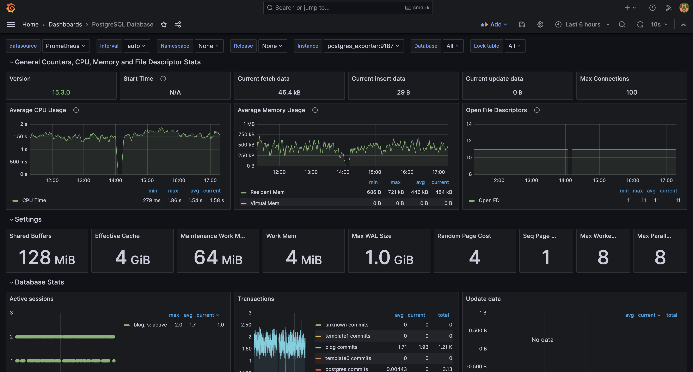

# docker-compose-db
Using Docker Compose, you can easily run a PostgreSQL database and provide an environment where basic metrics can be collected and monitored.

## 0. Preparations

Basically, Docker Compose is required. If you want to run it in a local environment, you can install Docker Desktop and proceed. If you are unable to install [Docker Desktop](https://www.docker.com/products/docker-desktop/) in your environment, you can refer to this [Link](https://docs.docker.com/engine/install/) to install Docker and Docker Compose on your desired operating system and proceed.

## 1. Setup ENV

You need to duplicate the `.env.sample` file provided as a sample and rename it to `.env`, then fill in the values that match your environment.

```
cp .env.sample .env
```

## 2. Run Docker Compose

Once the environment configuration is completed, you can use Docker Compose to run the application.

```
docker compose up
```

## 3. Monitoring

You can access Grafana, which is installed along with the application, to check the current state of your PostgreSQL database.

```
http://localhost:3000
```

